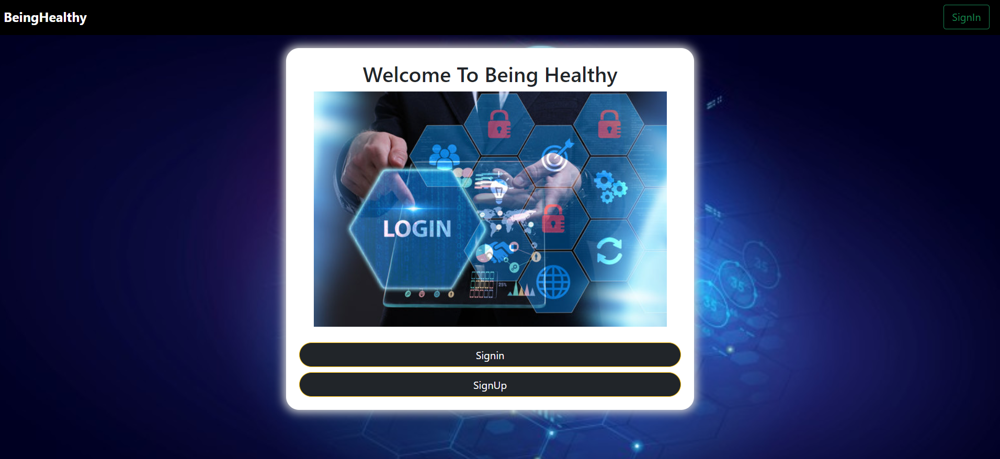
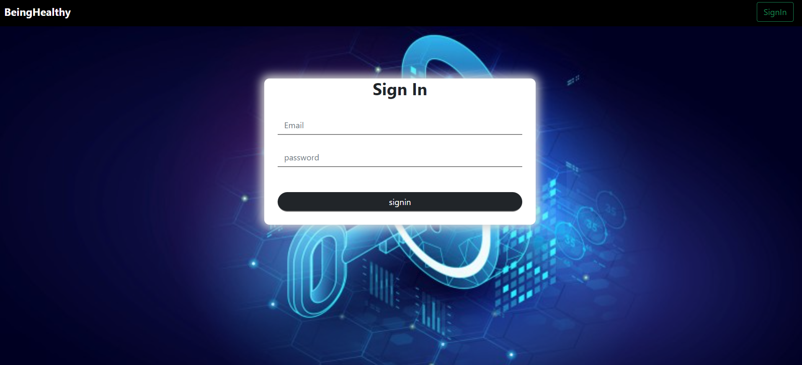
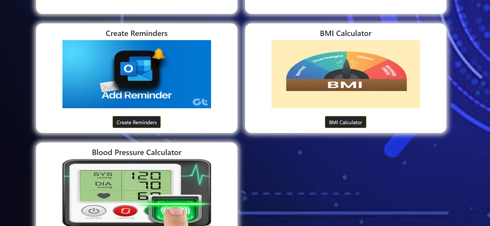
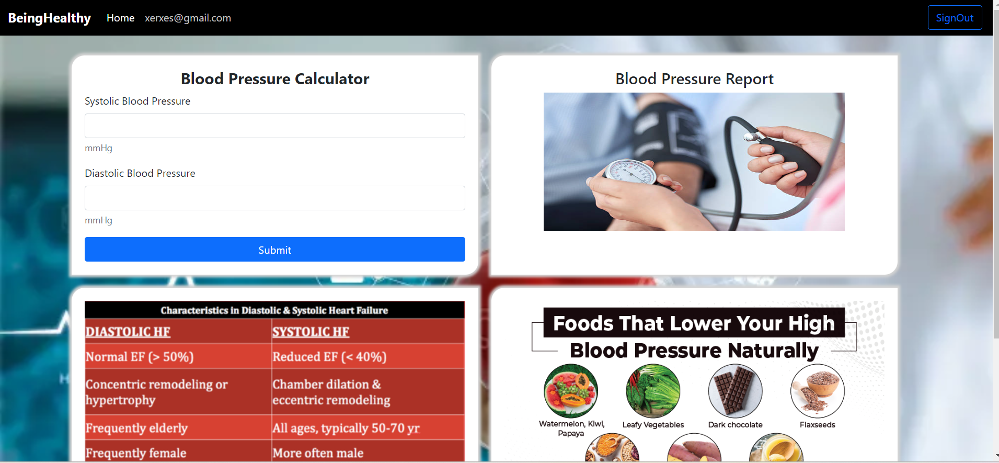
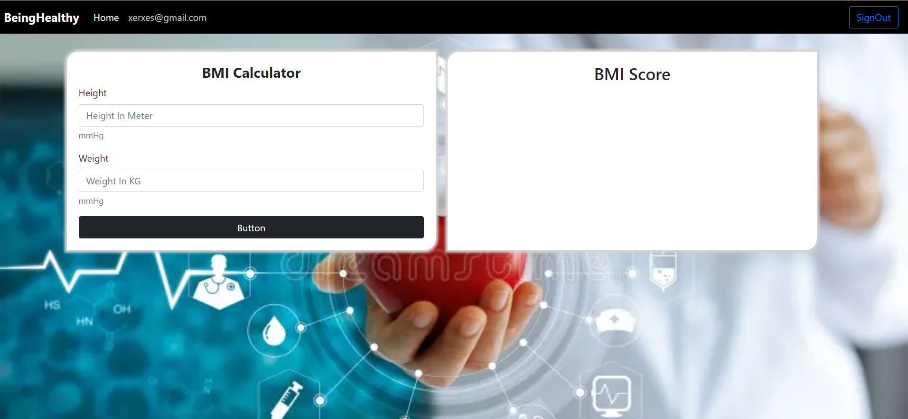
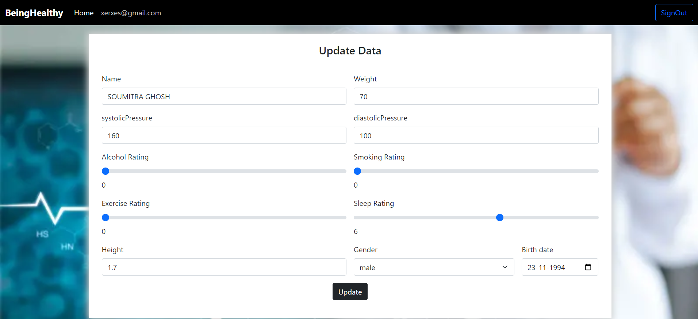

Hosted On--https://beinghealthy.onrender.com/

# Setup in Local System

    1. git clone https://github.com/ghoshSoumitra/Beinghealthy
    2. open command prompt and Type 'npm install' for download all dependencies
    3. then just "npm start"/ if npm start is not work just run this command 'node index.js'
    4. then go localhost:8000

## Screen Shot

1. Home Page

2. Sign In Page 

3. User Dashboard

4. Calculate Blood Pressure

5. Calculate BMI

6. user Data

